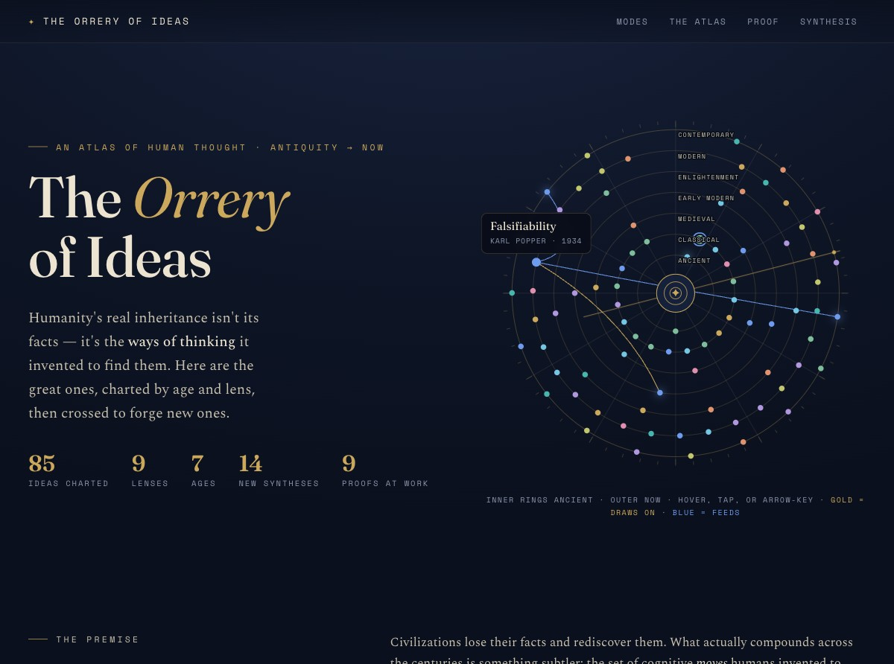
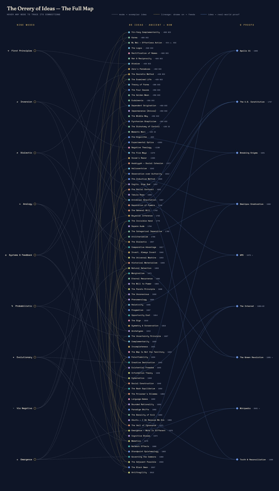
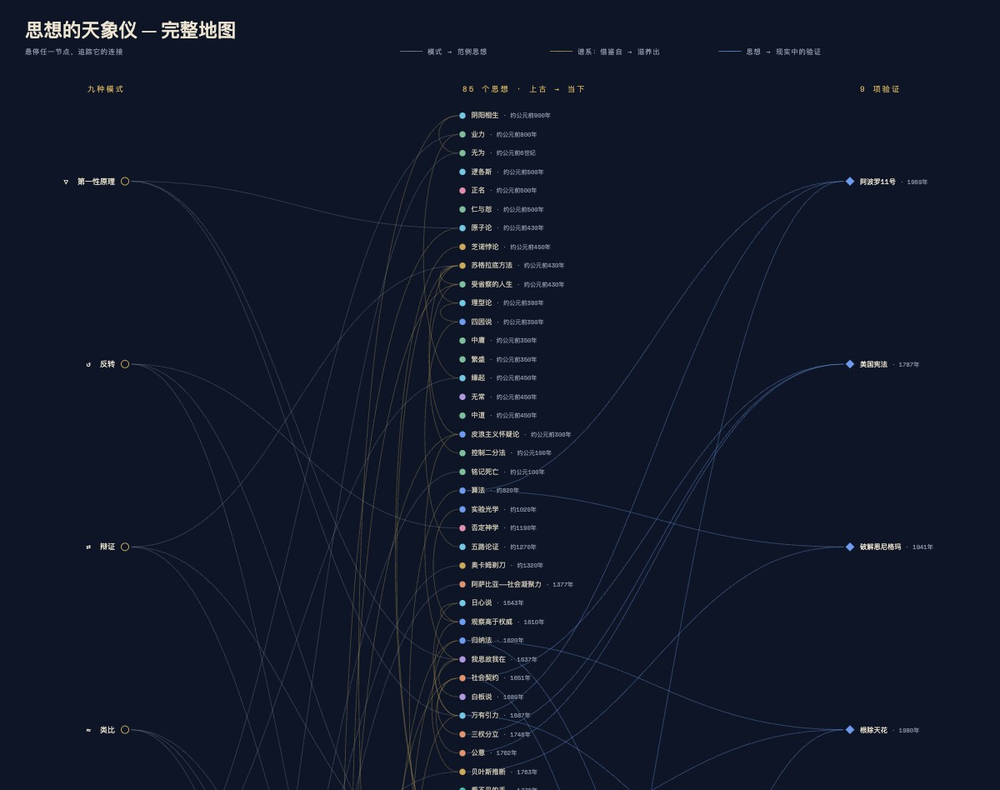

# ✦ The Orrery of Ideas

**An atlas of human thought — not the facts humanity discovered, but the ways of thinking it invented to find them.**

A single self-contained web page that charts 85 great ideas from antiquity to today, traces how they descend from one another, shows them at work in real-world achievements, and crosses them to forge new ones. No build step, no dependencies, no framework — just open `index.html`.



## The premise

> A fact is an answer. A way of thinking is a method for generating answers.

Civilizations lose their facts and rediscover them. What compounds across centuries is subtler: the cognitive *moves* humans invented to make sense of things — to doubt, to abstract, to invert, to model, to update, to subtract. Every entry here pairs an idea with **the move** it teaches: the transferable way of thinking you can carry into your own problems.

## What's inside

- **The Astrolabe** — an interactive SVG instrument. Rings are ages (Ancient at the center → Contemporary at the edge); each point is an idea, colored by category. Hover, tap, or arrow-key a point to see it — and to see its **lineage threads**: gold back to what it drew on, blue forward to what it fed.
- **Nine Modes** — the meta-patterns that recur beneath everything: first principles, inversion, dialectic, analogy, systems & feedback, probabilistic thinking, evolutionary thinking, via negativa, emergence.
- **The Atlas** — all 85 ideas as filterable cards (by lens, by age, by search), each with its idea, its move, and clickable *draws on / feeds* lineage links.
- **The Proving Ground** — nine great achievements traced back to the ways of thinking inside them: Apollo 11, the U.S. Constitution, breaking Enigma, smallpox eradication, GPS, the Internet, the Green Revolution, Wikipedia, and South Africa's Truth & Reconciliation.
- **The Synthesis Lab** — fourteen new ideas forged by crossing old ones (Bayesian Stoicism, The Virtue Thermostat, The Constitutional Mind…), because recombination is itself a way of thinking.
- **The Full Map** — one click opens a borderless SVG diagram in a new tab: modes → ideas → proofs as a three-column graph of 103 nodes and 110 edges. Hover any node to spotlight its entire constellation.



## Six languages

The page ships in **English · 简体中文 · 繁體中文 · 日本語 · Français · Deutsch** — full content translation (every idea, move, proof, and synthesis), not just the UI. Switch with the selector in the nav; the choice persists, and `?lang=ja`-style URLs work as shareable links. The Full Map carries its own switcher.



## Running it

Open `index.html` in a browser. That's it.

If your browser restricts `file://` pages, serve it instead:

```bash
python3 -m http.server 8000
# then open http://localhost:8000/index.html
```

## How it's built

Everything lives in one `index.html` (inline CSS + vanilla JS; the only network calls are Google Fonts). A few design decisions worth knowing:

- **Data as the single source of truth.** Four arrays in the script block — `IDEAS`, `MODES`, `SYNTH`, `PROOFS` — drive every section, count, and visualization. Edit the data, not the markup.
- **Lineage is data too.** Ideas carry an optional `deps` field naming their genuine intellectual ancestors (descent and response only — cross-cultural rhymes are deliberately excluded). Descendants are computed, never hand-written.
- **Languages are overlays.** English is canonical; each language pack translates display fields only, while all internal wiring (lineage, chips, the map) keys off canonical names. A missing translation falls back to English instead of breaking.
- **The map is generated, not duplicated.** The Full Map document is built at runtime from the same arrays and opened via a Blob URL — no second file to keep in sync.
- **Accessibility is a floor, not a feature.** Keyboard navigation across the astrolabe (roving tabindex — one tab stop, arrows walk the timeline), visible focus states, ARIA labels throughout, and `prefers-reduced-motion` support.

## License

[MIT](LICENSE)

---

*Built from a one-paragraph brief ([spec.md](spec.md)) with [Claude Code](https://claude.com/claude-code).*

*Remember: the map is not the territory — including this one.*
